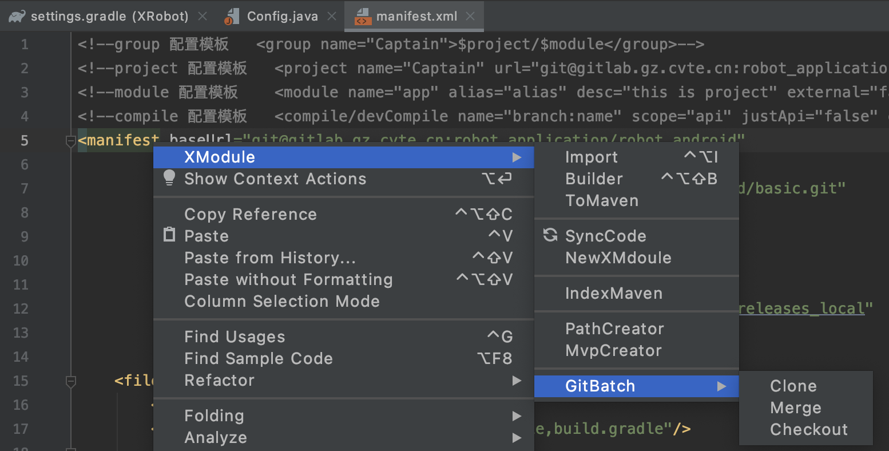
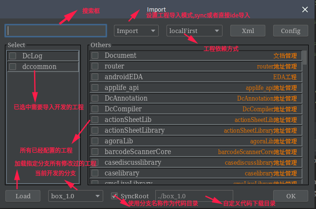
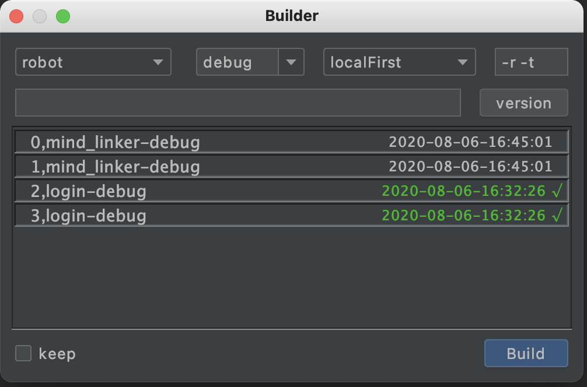
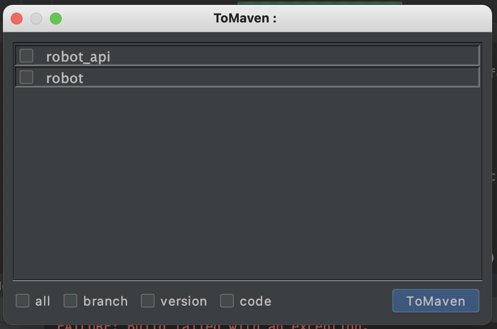
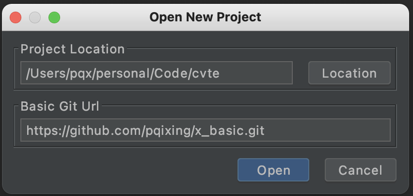
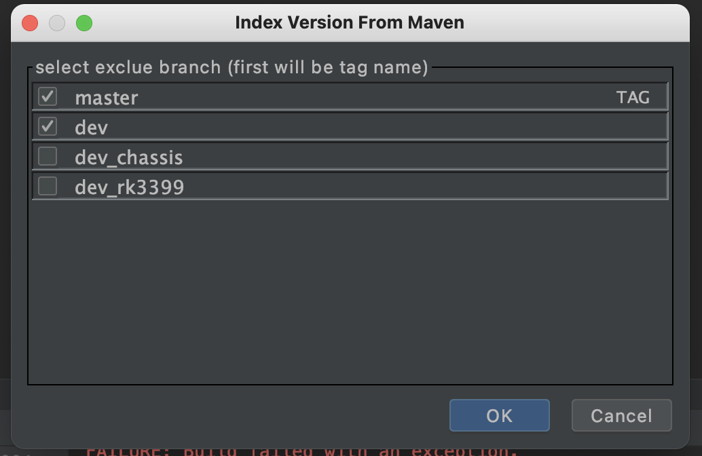
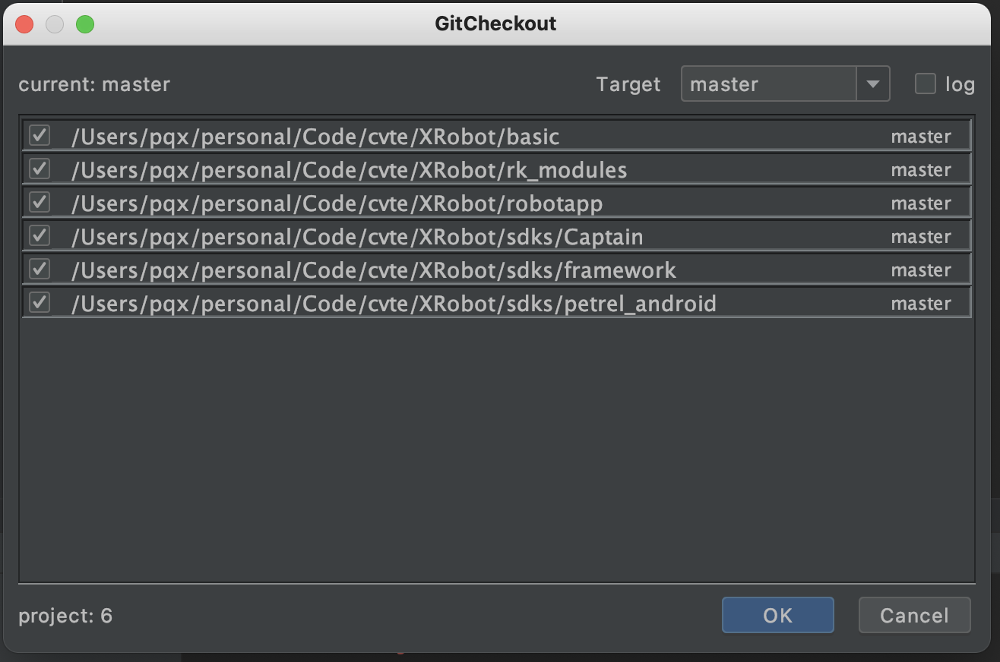

##  XModule
#### 介绍
XModule 是一个组件化管理系统,实现像开发一个独立应用一样开发组件，提供快捷进行多分支多产品开发


### 支持功能
* 组件代码按需导入和自动下载管理
* 实现仓库组件和本地代码依赖的无缝切换,方便组件间协调开发
* 组件无需修改任何配置,通过插件直接快速运行. 既是模块也是app类型
* 一键快速发布组件到指定仓库,其他协作者无感知即可快速集成最新组件
* 支持所有组件工程多git工程批量进行git操作,包含checkout, merge, branch等操作
* 组件支持分离api模块层,支持只对外暴露api层, 从框架层彻底隔离组件,防止相互交叉引用
  
  
### 快速使用集成
* 在AndroidStudio -> Settings-> Plugins 搜索 [XModule](https://plugins.jetbrains.com/plugin/12121-xmodule) ,安装ide插件
* 在工程root目录的setting.gradle中,添加以下代码,然后同步，在弹出的对话框，输入basic工程的Git地址
```
buildscript { apply from: 'https://gitee.com/pqixing/XModule/raw/master/script/install.gradle', to: it }; apply plugin: 'com.module.setting'
```

或者使用AndroidStudio -> File -> NewXModule ， 然后输入basic工程地址，即可打开一个XModule框架的工程
> 同步一下,根目录下会生成[Config.java](tools/src/main/java/com/pqixing/Config.java) 文件,需配置git用户名和密码,其他配置参数见注释
```
public class Config {
    /**
     * 用户名称,可用于git
     */
    public String userName = "pengqixing";

    /**
     * 用户密码,可用于git
     */
    public String passWord = "pengqixing";
}
```
> [basic工程](https://github.com/pqixing/x_basic.git) :用来存在模版和模块配置的工程，第一次改造时，需要建立该工程并配置相关属性，其余开发人员直接使用该工程地址即可快速进入开发。详细请查看demo

### 开发操作说明 
* 在编辑页面点击右键即可看到XModule菜单。  
### 功能说明
* Import : 负责模块导入管理，同时会管理模块代码的下载。 
 
* Builder ：负责模块构建，支持快速构建模块和应用并且安装打开，支持历史构建查询 
* FastBuilder : 当Builder中勾选了Keep时，会在设备右边显示快捷构建按钮，点击则快速构建上次build项目  
* ToMaven ： 快捷打包当前工程到仓库中，支持多模块批量打包，版本设置(默认无需设置)在manifest.xml文件中配置  
* SyncCode : 更新仓库依赖版本号索引和当前code代码，为了避免干扰正常开发，仓库依赖版本号手动更新或者在tomaven操作时会自动更新
* NewXModule ：使用basic工程地址，打开新的XModule工程 
* IndexVersion : 扫描maven仓库，重新生成版本号索引（SyncCode只更新索引到本地）,或者为指定分支，生成版本tag文件，在版本号索引出错时使用 
* PathCreator : 为跨组建的path文件生成快捷调用的代码模版 
* MvpCreator : 生成快捷的mvp代码模板
* GitCheckout : 批量快捷切换本地所有工程的分支  
* GitMerge : 对本地所有工程提供批量git操作，支持创建分支，合并分支，删除分支 
  


